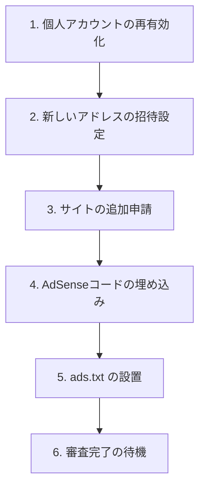

# Google AdSense 登録・申請手順ガイド

このガイドは、「SNS反応まっぷ」を Google AdSense に登録し、審査および広告の配信設定を行うための手順書です。

---

## 全体フローの概要



---

## 1. 個人アカウントの再有効化

過去に登録があり休眠状態（無効化）になっている場合は、まずそれを再開します。

1. **[Google AdSense 公式サイト](https://adsense.google.com/)** に個人用のGoogleアカウントでログインします。
2. 画面の **「アカウントを再有効化」** をクリックします。
3. 電話番号の確認（SMSなど）を求められるため、画面の指示に従って完了させます。

---

## 2. 新しいアドレス（共同管理者）の招待設定

個人用のアカウントではなく、新しく取得したこのプロジェクト専用のアドレスで今後は管理できるようにします。

1. 再有効化したAdSenseの管理画面に入ります。
2. 左メニューから **「アカウント」 ＞ 「アクセスと認証」 ＞ 「ユーザー管理」** をクリックします。
   * ※「アクセスと認証」がクリックできない（グレーアウトしている）場合、お支払い情報の追加やサイトの登録を先に進める必要があります（次のステップへ進んでください）。
3. 「新規ユーザー」欄に、今回取得した**新しいメールアドレス**を入力し、**「招待を送信」** をクリックします。
4. 新しいアドレスのメールボックスを確認し、届いた招待メール内のリンクから招待を承認します。

---

## 3. サイトの追加申請

1. 左メニューまたはダッシュボードから **「サイト」** ＞ **「サイトを追加」**（または「開始」ボタン）をクリックします。
2. ウェブサイトのURLの入力欄に以下を入力します。
   * **`https://issue-stance-lab.github.io`** または **`issue-stance-lab.github.io`**
   * ⚠️ **注意**: `.../sns-reaction-map/index.html` などの末尾のファイルパスやサブフォルダは入力せず、ドメイン部分のみを入力してください。
3. 「保存」をクリックします。

---

## 4. AdSenseコード（審査用コード）の埋め込み

サイト登録が進むと、**審査用コード（AdSense接続コード）**（例: `<script async src="...client=ca-pub-XXXXXXXXXXXXXX"...></script>`）が画面に表示されます。

1. 画面に表示されたコード、または `ca-pub-` から始まるパブリッシャーIDをコピーします。
2. 開発環境のターミナルで、今回追加した一括適用スクリプトを実行します。
   ```bash
   # 例：パブリッシャーIDが ca-pub-1234567890123456 の場合
   python3 scripts/seo/apply_adsense_tags.py --client-id ca-pub-1234567890123456
   ```
3. `git add -A && git commit -m "add: adsense code" && git push` でGitHub Pagesにデプロイします。
4. デプロイ完了後、AdSense管理画面に戻り、「コードを配置しました」にチェックを入れて「完了」を押します。

---

## 5. ads.txt の設置

広告の所有権を示す `ads.txt` を配置します。

1. 開発環境のターミナルで、SEOアセット生成スクリプトをアドセンス用オプション付きで実行します。
   ```bash
   # 例：パブリッシャーIDが ca-pub-1234567890123456 の場合
   python3 scripts/seo/generate_seo_assets.py --site-url https://issue-stance-lab.github.io/sns-reaction-map/ --adsense-client ca-pub-1234567890123456
   ```
   これにより、自動的に `docs/ads.txt` が生成されます。
2. `git add -A && git commit -m "add: ads.txt" && git push` でデプロイします。

---

## 6. 審査完了の待機

Googleによるサイトの審査が始まります。
審査には数日から最大で数週間かかる場合があります。審査中はコンテンツの追加（週に数回程度の更新）を継続して行い、サイトが活発に運用されていることをGoogleにアピールすると、合格率が高まります。
